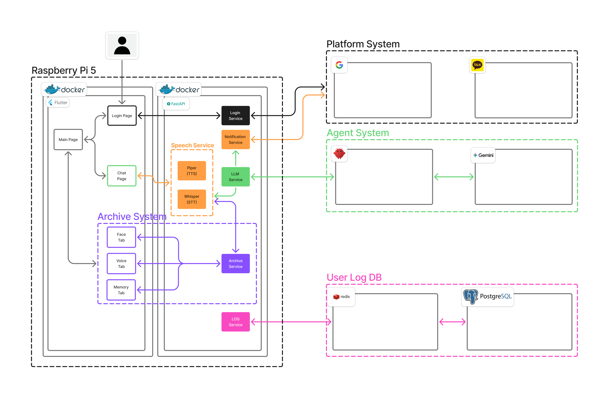

# Overview

This repository is a development kit built around a Flutter web frontend and a FastAPI backend.
It is designed to provide a small internal tool platform with API testing, Slack notifications,
SSH execution, Jira integration, and LLM utilities.

## Architecture




## Features

- Login/session flow for local app entry
- API collection test runner
- Jira issue creation (including attachments)
- Activity/session logging
- Slack message sender
- LLM request testing
- SSH command execution helpers

## Setup

### Services

- `web`: Serves the Flutter web build with Nginx and reverse-proxies `/api/*` to `api`
- `api`: FastAPI (Uvicorn) with `root_path=/api`
- `postgres`, `redis`: Session/state storage

### Environment Variables (`.env`)

Copy `.env.example` to `.env` and fill in the required values.

Important groups:

- General: `LOG_LEVEL`, `VERSION`
- Session/Auth: `AUTO_LOGOUT_SECONDS`, `SESSION_*`
- Storage: `POSTGRES_DSN`, `POSTGRES_POOL_*`, `REDIS_URL`, `POSTGRES_DB`, `POSTGRES_USER`, `POSTGRES_PASSWORD`
- Files/Paths: `COLLECTION_FILE`, `COLLECTION_PATH`, `AWS_SSH_KEY_PATH`, `AWS_SSH_ALIASES_PATH`
- Integrations: `JIRA_*`, `SLACK_WEBHOOK_URL`, `LLM_*`, `OPENWEBUI_*`
- Server: `SERVER_HOST`, `SERVER_PORT`

`COLLECTION_FILE` / `COLLECTION_PATH` are optional now. If omitted, compose uses
`./backend/collection.json` -> `/app/collection.json`.

### Run / Build

```bash
docker compose up --build
```

### Flutter Build Notes

If the Flutter project is missing generated scaffolding and Docker build fails, run:

```bash
cd frontend
flutter create .
flutter pub get
cd ..
docker compose up --build
```

## Access

- `http://localhost:8080/` (Web UI)
- `http://localhost:8080/api/health` (API health check)
- `http://localhost:8080/api/docs#/` (API docs)
