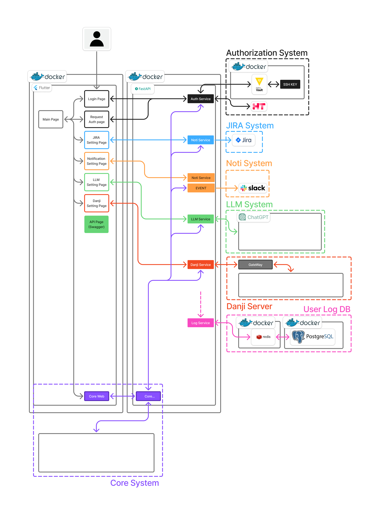

# Overview
이 저장소는 Vibe Coding 방식을 기반으로 한 학습 프로젝트입니다.  
아이디어를 신속하게 구현하고 실행하며 개발 흐름을 익히는 데 목적이 있습니다.  
부가적인 기능은 Dev Base Kit에서 제공하여, 핵심 기능 개발에 집중할 수 있도록 구성했습니다.

## Architecture


[자세한 기능 명세서](https://hyundaiht.atlassian.net/wiki/spaces/~sjshin/pages/1896382501/Vibe+Coding+-)

## Function
- `로그인`: 통합인증 계정 정보를 활용한 로그인 시스템 제공.
- `접속`: 단지서버 및 세대에 접속/접근 할 수 있는 기능 제공.
- `API TEST`: 단지서버/세대에 API를 요청/응답하고 로그를 추출하는 기능 제공.
- `일감등록`: 추출한 로그와 영상 및 사진을 JIRA에 바로 등록할 수 있는 기능 제공.
- `감사로그`: 로그인부터 로그아웃 순간까지의 사용자 이력을 로깅하는 기능 제공.
- `Slack`: Slack URL로 원하는 메시지를 보낼 수 있도록 기능 제공. (서버에 이벤트 발견시 알림용)

# Setup

**구성 요약**
- `web`: Flutter Web 빌드 결과를 Nginx로 서빙, `/api/*` 요청을 `api`로 리버스 프록시
- `api`: FastAPI (Uvicorn), 앱 내부 `root_path=/api`
- `vault`, `vault-agent`: SSH 키 등 시크릿 주입
- `postgres`, `redis`: 세션/상태 저장소

**환경 변수 (.env)**
[Dev Base Kit Config 문서](https://hyundaiht.atlassian.net/wiki/spaces/~sjshin/pages/1840283723)
`.env.example`에 기본 키가 정의되어 있습니다. 주요 항목은 아래와 같습니다.
- 공통: `LOG_LEVEL`, `VERSION`
- 세션/인증: `AUTO_LOGOUT_SECONDS`, `SESSION_*`, `OAUTH_TOKEN_URL`, `DJ_OAUTH_*`
- 데이터 저장소: `POSTGRES_DSN`, `POSTGRES_POOL_*`, `REDIS_URL`, `POSTGRES_DB`, `POSTGRES_USER`, `POSTGRES_PASSWORD`
- 파일/키 경로: `COLLECTION_FILE`, `COLLECTION_PATH`, `AWS_SSH_KEY_PATH`, `AWS_SSH_ALIASES_PATH`
- 외부 연동: `JIRA_*`, `SLACK_WEBHOOK_URL`, `LLM_*`, `OPENWEBUI_*`
- 서버: `SERVER_HOST`, `SERVER_PORT`

**실행/빌드**
[Dev Base Kit Setup 문서](https://hyundaiht.atlassian.net/wiki/spaces/~sjshin/pages/1840349204/Vibe+Coding+-+2)
[Dev Base Kit Config 문서](https://hyundaiht.atlassian.net/wiki/spaces/~sjshin/pages/1840283723)
1. `.env.example`을 복사해서 `.env` 값 채우기
2. 최소 필수값 확인
   - `COLLECTION_FILE`: 호스트의 컬렉션 파일 경로 (예: `./collection.json`)
   - `COLLECTION_PATH`: 컨테이너 내부 경로 (기본: `collection.json`)
3. 필요 시 외부 연동값 설정 (`JIRA_*`, `LLM_*`, `SLACK_WEBHOOK_URL`, `OPENWEBUI_*`, `AWS_SSH_*`)
4. 컨테이너 빌드 및 실행

```bash
docker compose up --build
```

***Flutter 빌드***
- Flutter 프로젝트가 완전한 `flutter create` 구조가 아닐 수 있습니다. Docker 빌드 중 Flutter 스캐폴딩이 없다고 나오면 아래를 먼저 실행하세요.

```bash
cd frontend
flutter create .
flutter pub get
cd ..
docker compose up --build
```

**접속**
- `http://localhost:8080/` (Web - DevBaseKit)
- `http://localhost:8080/api/health` (API 헬스체크)
- `http://localhost:8080/api/docs#/` (Web - API Docs)
- `http://localhost:8200/` (Web - Vault)
